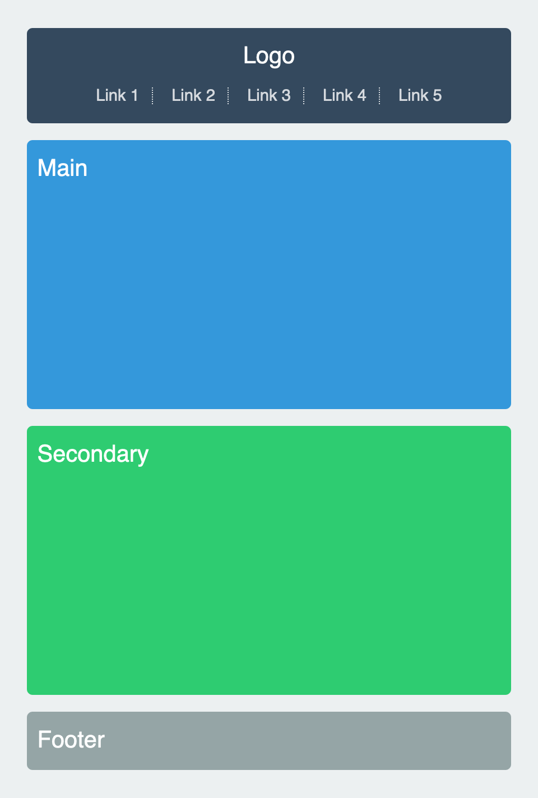
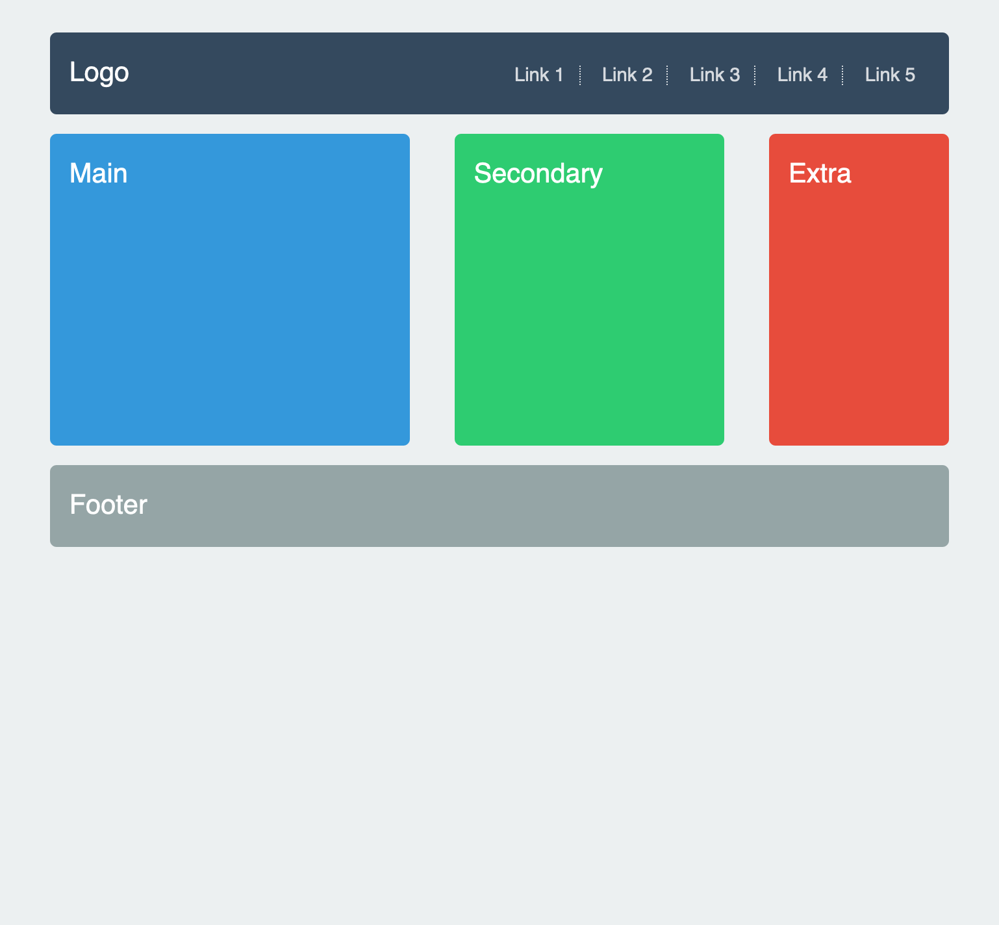

# Exercice Media Queries

L'objectif de cet exercice et de découvrir et pratiquer les média queries CSS.

Support de cours : https://openclassrooms.com/fr/courses/1603881-apprenez-a-creer-votre-site-web-avec-html5-et-css3/1607616-utilisez-le-responsive-design-avec-les-media-queries

Pour réaliser cet exercice, vous devez **uniquement modifier le code du 
fichier** `responsive.css`.

[Voir la vidéo de l'exemple de solution](https://www.youtube.com/watch?v=S_bMx44P6gs)

---
## Étape 1 - Version pour les écrans `<= 480px`

* Affichage sur une colonne.
* L’élément « extra » en rouge est caché.

---
## Étape 2 - Version pour les écrans `> 480px`

* Affichage sur deux colonnes.
* L’élément « extra » est caché.
* Colonne « main » : 65%
* Colonne « secondary » : 30%
* Marge : 5%

---
## Étape 3 - Version pour les écrans `> 768px`

* Affichage sur trois colonnes.
* L’élément « extra » est affiché.
* Colonne « main » : 40%
* Colonne « secondary » : 30%
* Colonne « extra » : 20% 
* Marges : 5%
* Le menu s’affiche à droite et le logo à gauche.

---
## Étape 4 - Version pour les écrans `> 1023px`

* Affichage sur trois colonnes 
* L’élément « extra » est affiché. 
* Colonne « main » : 40%
* Colonne « secondary » : 30%
* Colonne « extra » : 20%
* Marges : 5%
* Le menu s’affiche à droite et le logo à gauche.
* Largeur maximum du site : 980px

